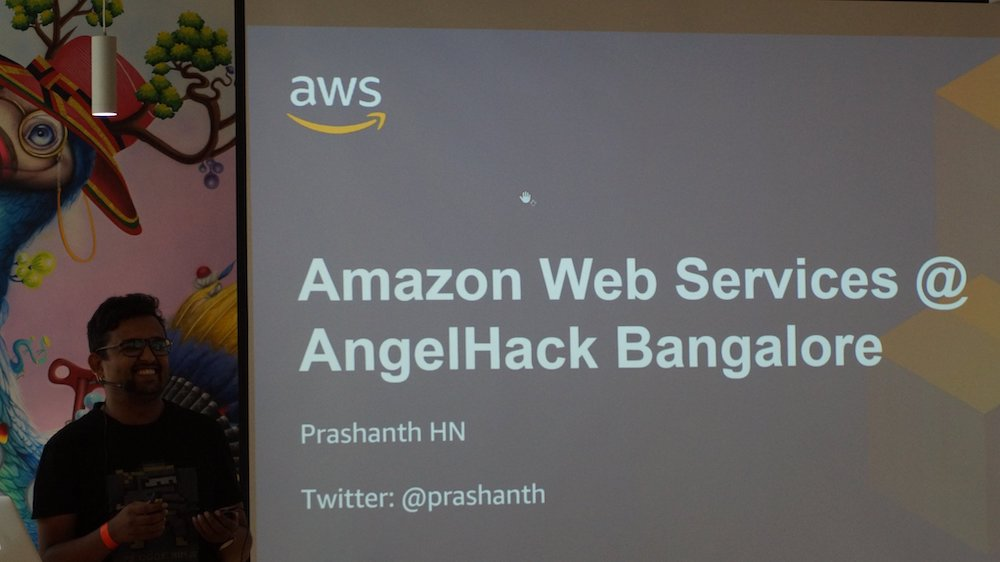
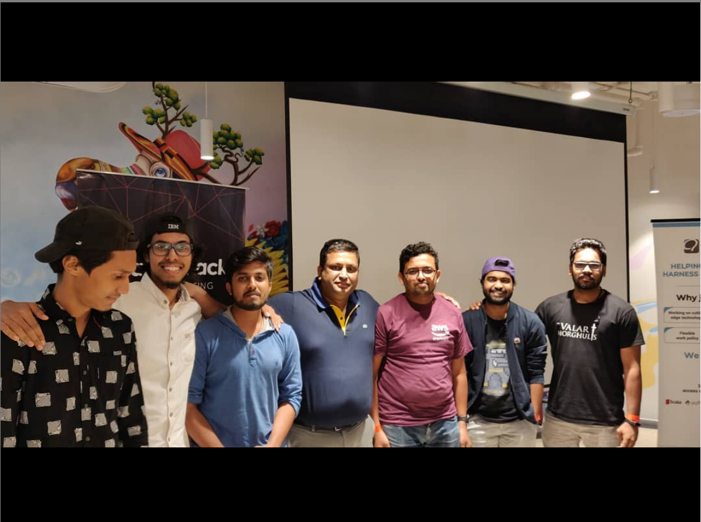

It's been a while I had been to Hackathons since I was completely immersed into my entrepreneurial quest, the last one being Yahoo hackathon almost a decade ago! When I got a request from AWS to be the mentor for AWS Amplify at AngelHack, I said "sure" with all the excitement and nostalgia kicking in!

Harish from AngelHack kicked off the event and announced different challenges and respective prizes and later introduced all mentors. AWS Amplify challenge was ***"Use AWS Amplify to build the best working mobile or web app that connects to at least one AWS service".*** Beginning of the day was quite busy as a mentor for me with many teams lining up to ask questions and doubts! A lot of teams didn't know about Amplify and were curious how they could use Amplify for their project to qualify for AWS Amplify challenge!

### My Session on Amplify

All the sponsors had a slot to present about their offering and shed more light on the challenge. Since I was representing AWS, I got this great opportunity to present at the Hackathon. My talk was 30 minutes long in which I explained how AWS Amplify can accelerate the development process for web & mobile apps. How one can build real-time, offline ready, scalable backends at ease using AWS Amplify. This was specifically more important in a Hackathon where one should put all their focus on their ideas than the backend or stack.

### Build Build Build

Post noon, everyone seemed a lot more serious discussing stacks and architecture for their respective ideas. Teams started asking some complex questions now, many things which I had not explored before. Offerings like Interaction, PubSub which I knew Amplify supported but never had the use case to explore seriously. Being a mentor in Hackathon made me go through docs of these services which I hadn't explored before and realise there's more to Amplify than what I thought before. Teaching/Mentoring others really make ourselves push our own limits and get out of comfort zones!

### Judging!

AngelHack team requested me to be part of the judging panel and I gladly accepted. Teams were given 2 minutes to pitch & 1 minute for Q&A. Some teams used the time really well and some teams used up 2 mins just for the intro and had no time to demo what they had built! Presenting ideas in 2 minutes was really hard, but it was a level playing field, everyone got the same amount of time. Top 8 teams based on ratings from judges were given a chance to present in front of the whole crowd!

### My Picks!

Out of all pitches I really liked these ideas, which were also part of top 8 teams.

**magiCode**

> magiCode helps people who are not so efficient in a programming language ,code in that language using basic voice commands. This program helps with syntax. Users can also compete and find out how much they have learnt by practicing, while also earning Hackos doing the same. This in turn can be redeemed for exciting gifts. This way a "student" can explore, compete and gain knowledge as well as schwags- learn and earn.

**Onus**

> Increase accountability in participative events by paying a refundable token amount to reserve your seat.

Onus solves a problem which I personally face while organising meet-ups which are free. I have seen instances where there are 400 RSVPs and only 50 turn-up making it hard to plan. Not to forget wasted sandwiches!

**PharmAssist**

> A novel end to end medical aid.

PharmAssist helps people easily find out what meds they need to take at what time of the day. Taking advantage of capacitive touch screen of mobile phones, PharmEasy codes bottom of tablet bottles with small strips of touch sensitive tape/material. When the bottle is placed on screen, app right away detects the meds and show when to take it!

Hackathon was won by PodSpot which came up with low cost mesh network solution for disaster hit locations, magiCode won the IBM challenge & HoppShopp (Connecting Consumers to Local Stores) won the AWS Amplify Challenge, Agora challenge was won by TARDIS.

_With Mani Chandrasekaran from AWS, who was also part of panel of judges and Team HoppShopp who won AWS Amplify challenge_

I would like thank AWS again for giving me this opportunity to be the mentor for AWS Amplify . I would also like to thank organisers (Harish & team) for flawless execution and considering me for panel of judges. It was a great experience mentoring individuals and teams!