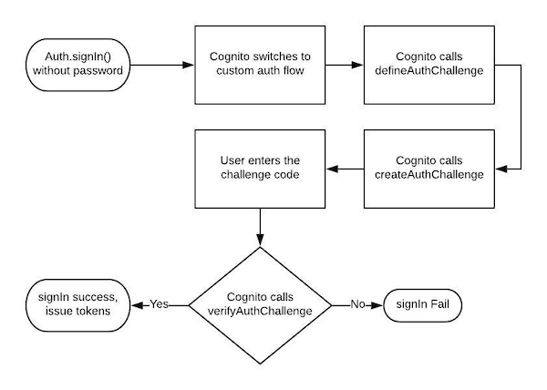
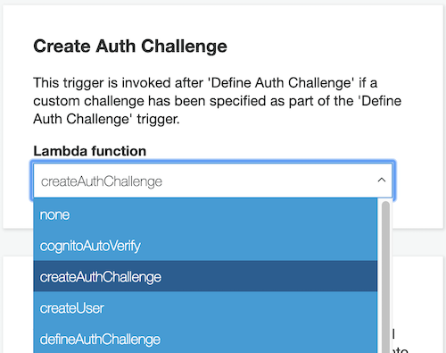

Amazon Cognito provides authentication out of the box with support for most of the authentication methods. I wanted to have Phone & OTP based authentication for my app since it's gaining lot of popularity in India. It eliminates the need to remember password & at the same time it verifies real identity in every login. The basic flow looks like this:

Click Login -> Enter Phone -> Receive 6 digit code to phone through Text/SMS -> Enter code -> Login Successful

Unfortunately, this is not natively supported by Cognito unlike Firebase. After some digging I found out about Custom Auth Flow in Cognito which allows developers to implement their own auth flows. AWS Amplify documentation for the same can be found here: https://aws-amplify.github.io/docs/js/authentication#customizing-authentication-flow. Since my app was built using React, Amplify was the perfect goto choice.

Calling Auth.signIn() without password triggers custom auth flow.

```javascript
  signIn = () => {
    const username = "+91" + this.state.username; //phone entered in form
    Auth.signIn(username).then(user => {
      this.setState({ user });
    });
  };
```

So what happens when Cognito enters into custom flow? Let's find out:



We need to define these functions in Lambda and configure Cognito as a trigger. Let's create these three functions in Lambda:

####defineAuthChallenge()

```javascript
exports.handler = async (event) => {
    if (!event.request.session || event.request.session.length === 0) {
        // If we don't have a session or it is empty then send a CUSTOM_CHALLENGE
        event.response.challengeName = "CUSTOM_CHALLENGE";
        event.response.failAuthentication = false;
        event.response.issueTokens = false;
    } else if (event.request.session.length === 1 && event.request.session[0].challengeResult === true) {
        // If we passed the CUSTOM_CHALLENGE then issue token
        event.response.failAuthentication = false;
        event.response.issueTokens = true;
    } else {
        // Something is wrong. Fail authentication
        event.response.failAuthentication = true;
        event.response.issueTokens = false;
    }
    return event;
};
```

####createAuthChallenge()

```javascript
const axios = require("axios");

sendSMS(phone_number, message) {
    // send SMS logic
}

exports.handler = async event => {
  if (!event.request.session || event.request.session.length === 0) {
    const phone = event.request.userAttributes.phone_number
    const otp = Math.floor(100000 + Math.random() * 900000)
    const message = "OTP to login to WebsiteX is "+otp
    sendSMS(phone, message)
    event.response.privateChallengeParameters = {
      answer: otp
    };
    event.response.challengeMetadata = "CUSTOM_CHALLENGE";
  }
  return event;
};
```

In the code above we generate a 6 digit OTP, send it to our user through SMS/Text and tell Cognito that 'OTP' is the "answer" we are expecting from user! Cognito will hold these attributes and give it to us when it triggers _verifyChallenge()_

Once user enters the OTP on the client we need to call Auth.sendCustomChallengeAnswer and pass it cognito user object we have in state & code entered by user

```javascript
sendChallenge = () => {
  Auth.sendCustomChallengeAnswer(this.state.user, this.state.code)
    .then(user => {
      console.log(user)
    })
    .catch(err => {
      console.log(err);
    });
  };
```

####verifyChallenge()

```javascript
exports.handler = async (event, context) => {
    if (event.request.privateChallengeParameters.answer === event.request.challengeAnswer) {
        event.response.answerCorrect = true;
    } else {
        event.response.answerCorrect = false;
    }
    return event;
};
```

As you can see above, we are comparing the answer entered by user with the answer attribute we set in _createAuthChallenge()_ with Cognito. If they match, then we tell Cognito we are good to go and Cognito will issue tokens to the user!

To configure these triggers, visit Cognito User Pool & go to "Triggers" menu. You will see all available triggers, map respective triggers to respective lambda functions



#### Few more things we need to take care of
Above implementation only talks about signIn and not new sign ups. Unlike signIn method, signUp requirs a password to be sent. I ended up generating a strong password on the client side and passing it to signUp. This is fine since the user will never need the password to login.

```javascript
    Auth.signUp({
      username: "+91" + this.state.username,
      password //generated password
    })
```

I have configured Cognito to verify phone number on signup, so first time users will receive their 6 digit code from Cognito itself. We will need to call Auth.confirmSignUp() instead of Auth.sendCustomChallengeAnswer() in this case.

```javascript
  verifyCode = () => {
    const username = "+91" + this.state.username;
    Auth.confirmSignUp(username, this.state.code, {
      forceAliasCreation: true
    })
  };
```

Another hicup here is that Cognito won't automatically signIn the user after confirmation! Now, if we call signIn() without password, it will trigger another SMS/Text with a code, which will annoy the user. To avoid this we need to call signIn() with password. So, we need to keep the password we generated in signup process in the client to reuse here.

####One final gotcha

When first time user registers and doesn't complete the confirmation step, Cognito sets the user status as "confirmation pending". Calling the Auth.signUp() next time will fail with error "user already exists". Calling Auth.signIn() will result in "confirmation pending" error. We can't call Auth.signIn() with password since we don't have the password. This puts the account in a limbo! This will not be an edge case since lot of times people enter random numbers when asked for a phone number & they never get the OTP/code since they don't own that phone number. This random number could potentially be a real phone number of someone else.

To address this issue I came up with a Lambda function which will be called before signup() to check if the account is in this limbo. If it is, I delete the account and tell the client to go with normal user registration process.